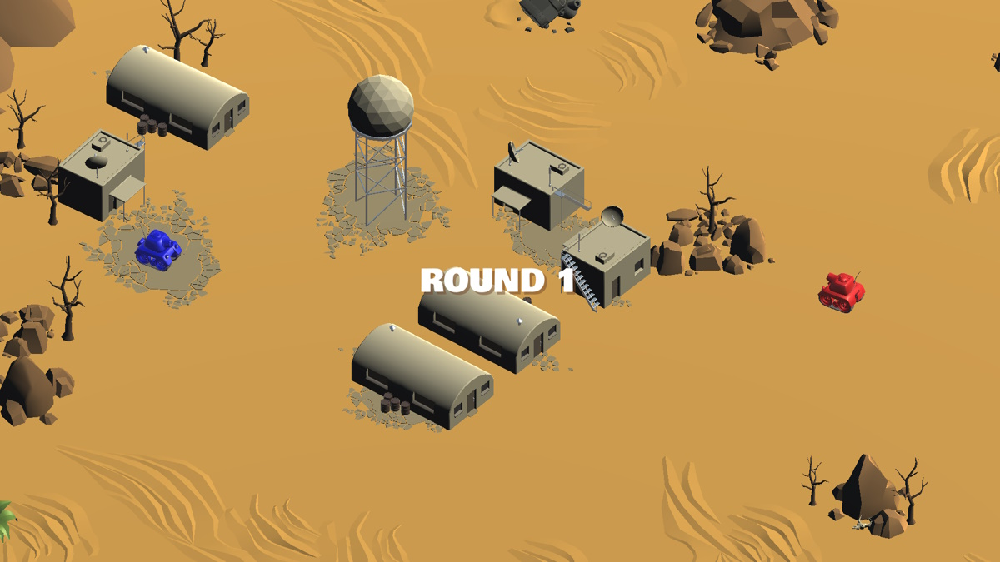

# Tanks

> My first [tutorial](https://learn.unity.com/project/tanks-tutorial) in Unity3D

Built with *Unity3D 2019.4.14f1*.

## Controls ##

| Action          | Player 1                |
| --------------- | ----------------------- |
| Drive Forward   | W                       |
| Rotate Left     | A                       |
| Drive Backward  | S                       |
| Rotate Right    | D                       |
| Jump            | Left Shift              |
| Shoot           | Space Bar               |

 

| Action          | Player 2                |
| --------------- | ----------------------- |
| Drive Forward   | Numpad 8                |
| Rotate Left     | Numpad 4                |
| Drive Backward  | Numpad 5                |
| Rotate Right    | Numpad 6                |
| Jump            | Arrow Left              |
| Shoot           | Arrow Down              |
